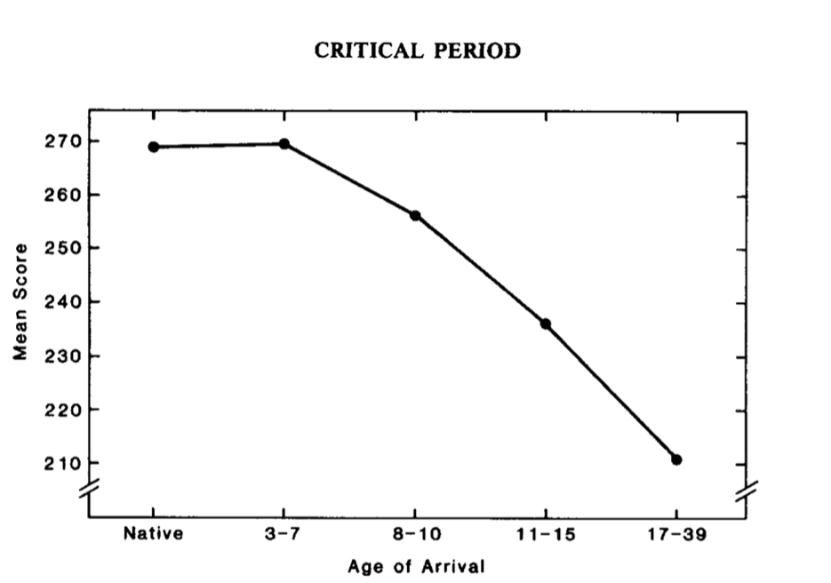
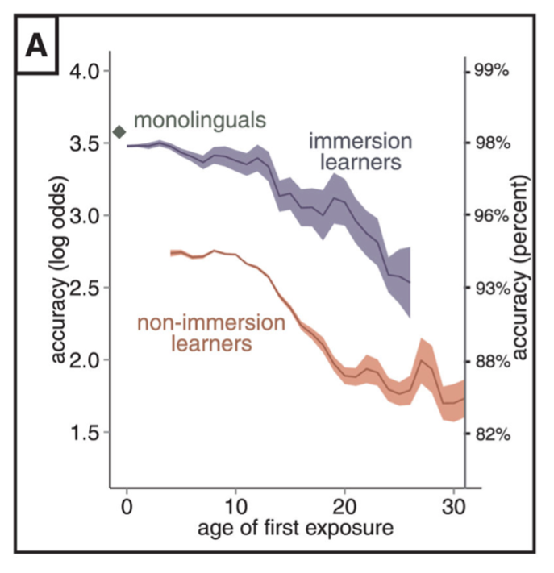
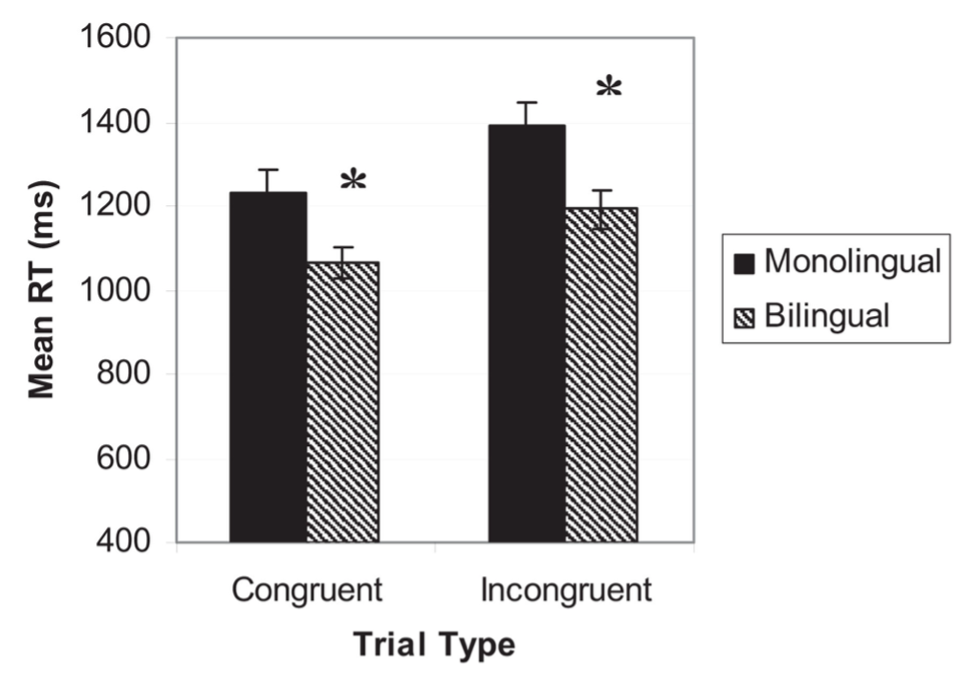
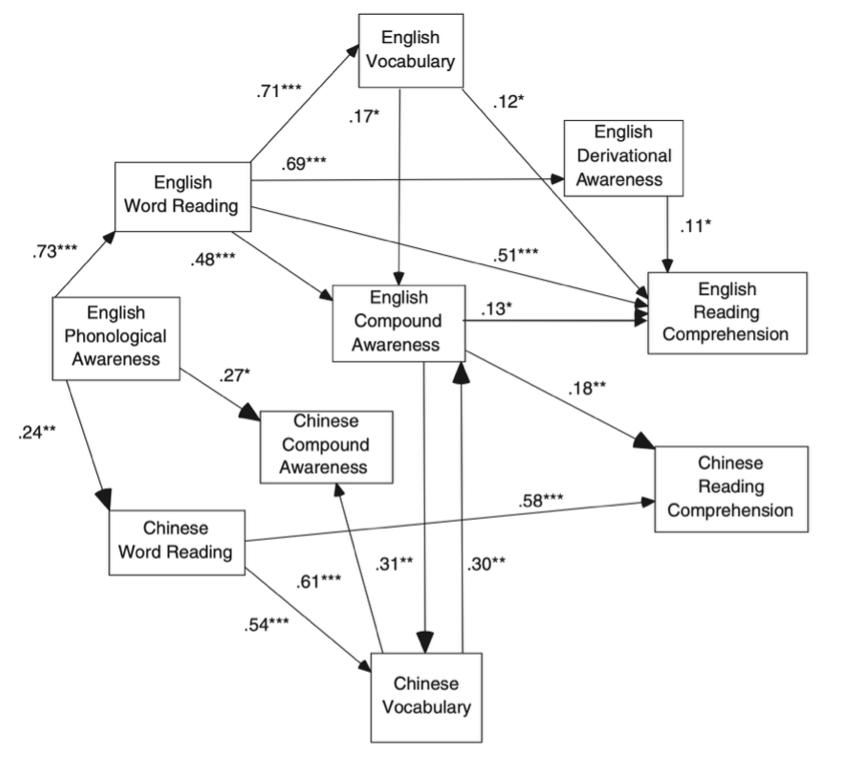

---
# === 輸出設定 ===
output_format: "cjp"

# === 論文基本資訊 ===
title_zh: "從第二語言習得之關鍵期，探討國小低年級同時授與中文與英文之適切性"
title_en: "Suitability of Simultaneous Chinese and English Instruction in Lower Elementary Grades: A Critical Period Hypothesis Perspective"
short_title: "Critical Period and Bilingual Education"

# === 作者資訊 ===
author_zh: "林錦坤"
author_en: "Lim, Chin-Kun"
affiliation_zh: "國立東華大學"
affiliation_en: "National Dong Hwa University"

# === 摘要 (根據前後文自動統整) ===
abstract_zh: |
  在全球化背景下，語言學習的起始年齡一直是教育心理學關注的焦點。本文旨在探討第二語言習得是否存在認知心理學上的關鍵期，並分析國小低年級（二年級以下）同時學習中英文的適切性。透過梳理關鍵期假說（Critical Period Hypothesis）的行為證據與神經認知科學研究（如 fMRI 腦造影證據），本文發現 10 歲前為語言學習的關鍵期，且早期雙語者的大腦傾向利用同一套神經網絡處理雙語。研究結果支持在國小低年級階段同時進行中英文教學，利用孩童神經可塑性的優勢與內隱學習機制，並透過跨語言遷移效應促進語言發展。文末亦針對教學策略提出實務建議。
  
keywords_zh: "關鍵期假說、第二語言習得、雙語教育、神經可塑性、跨語言遷移"

abstract_en: |
  In the context of globalization, the optimal age for language learning remains a key focus in educational psychology. This study investigates the validity of the Critical Period Hypothesis in second language acquisition and analyzes the suitability of simultaneous Chinese and English instruction for lower elementary students (Grade 2 and below). By reviewing behavioral evidence and neurocognitive research (e.g., fMRI studies), the findings suggest that the critical period for language acquisition occurs before age 10. Furthermore, early bilinguals tend to process both languages using shared neural networks. The results support simultaneous bilingual instruction in lower elementary grades, leveraging neuroplasticity and implicit learning mechanisms, while facilitating language development through cross-language transfer. Practical teaching strategies are also discussed.

keywords_en: "Critical Period Hypothesis, Second Language Acquisition, Bilingual Education, Neuroplasticity, Cross-language Transfer"
---

# 前言

如今在全球化的背景下，語言不僅是交流與溝通的工具，更有助於獲取新知、增廣見聞。語言學習的合適年齡亦是教育心理學長期關注的焦點之一。根據台灣教育部發布的《十二年國民基本教育課程綱要總綱》[@moe2014]，國小英語學科課程從國小三年級開始實施。然而，關於第二語言的習得是否存在認知心理學上的關鍵期？若是，則現行課綱所實施的三年級開始英語課程是否是最佳的介入時機？國小三年級前，學習英語是否會造成語言混淆等負面影響，抑或是更佳的學習黃金時期？本文主要梳理神經認知科學證據，探討關鍵期假說之有效性，並據此分析國小二年級以下同時授予中文與英文的適切性。

# 關鍵期假說之理論與行為證據

關鍵期假說最早由 Lenneberg 首次提出 [@lenneberg1967]，他提出語言習得存在一個受生理成熟限制的臨界期。這個臨界期從幼年早期延伸到青春期開始結束，語言習得的能力在青春期（12 或 13 歲）後呈斷崖式下降，此生理基礎與大腦偏側化有關，即青春期大腦偏側化成熟後，語言習得能力將顯著下降。

Johnson 與 Newport 在對 46 位移居美國的華裔與韓裔人士進行語法判斷任務 [@johnson1989]，測試他們對語法結構的掌握程度後發現，到達美國的年齡與最終的英語語法能力呈現強負相關，證實了 Lenneberg 提出的語言習得關鍵期假說也適用於第二語言習得（見圖 \ref{fig:johnson}）。

{#fig:johnson}
[Fig_Note] 註：圖中顯示受試者在英語語法測驗上的平均總分（Mean Score）隨抵達美國年齡（Age of Arrival）的變化情形。結果顯示，在 3 至 7 歲抵達美國的學習者，其測驗表現與母語人士（Native）無顯著差異；然而，隨著抵達年齡增長（特別是青春期後），測驗分數呈現顯著的線性下降趨勢。資料來源：改編自 Johnson and Newport（1989）。

Hartshorne 等人在分析約 67 萬人（英語為母語及非母語）的線上語法測驗數據後 [@hartshorne2018]，得出的結果強烈支持語言習得的關鍵期假說，且語言習得能力在約 17 歲左右開始劇烈下降。若要達到與母語者相近的水平，學習者必須在 10 到 12 歲之前開始學習英語（見圖 \ref{fig:hartshorne}）。

{#fig:hartshorne}
[Fig_Note] 註：本圖顯示單語者（Monolinguals）、沉浸式雙語學習者（Immersion learners）與非沉浸式學習者（Non-immersion learners）的語言極致成就（Ultimate attainment）曲線（經三年浮動窗口平滑化處理）。陰影區域代表 $\pm 1$ 標準誤。數據顯示，若要達到接近母語人士的極致成就，初次接觸英語的年齡必須在 10 至 12 歲之前；此後學習成效開始顯著下滑。資料來源：改編自 Hartshorne et al.（2018）。

# 大腦神經機制之觀點

Kim 等人使用功能性磁振造影（fMRI）研究母語與第二語言在大腦皮層中的表徵是否存在空間分離 [@kim1997]。實驗結果顯示，若第二語言在童年早期習得，母語和第二語言在布洛卡區域中傾向共用相同的皮層區域；反之，在成年後習得第二語言，兩種語言則在鄰近的皮層區域，空間上是分離的（見圖 \ref{fig:kim}）。在韋尼克區，無論是童年早期或是成年後習得第二語言，都顯示最小或幾乎沒有空間分離。因此，若在童年早期習得第二語言，大腦能夠利用同一套神經網絡來處理兩種不同的語言。

{#fig:kim}
[Fig_Note] 註：（A）晚期雙語者（Late Bilingual）：fMRI 影像顯示母語（紅色）與第二語言（黃色）在下額回（Inferior Frontal Gyrus）的活化區域呈現空間分離（中心點距離 7.9 mm）。（B）早期雙語者（Early Bilingual）：影像顯示母語（紅色）與第二語言（黃色）在同一區域呈現高度重疊（橘色，中心點距離 < 1.5 體素），證實早期學習能促使大腦利用同一套神經網絡處理雙語。資料來源：改編自 Kim et al.（1997）。

Pliatsikas 提出「動態重組模型」（Dynamic Restructuring Model）[@pliatsikas2020]，用時間歷程來解釋在經驗驅動下，神經可塑性如何影響雙語者的大腦結構。雙語經驗能夠促使大腦結構進行適應性調整，增強認知控制與效率，其關鍵在於灰質的階段性轉變。此外，語言學習會導致白質的完整性和連接效率的提高。這種動態的結構能夠幫助大腦對抗衰老過程和病理性神經退化。這表示學習第二語言能夠透過神經可塑性優化大腦結構（見圖 \ref{fig:pliatsikas}）。

{#fig:pliatsikas}
[Fig_Note] 註：該模型預測了隨著雙語經驗增加（從初次接觸、固化期到高效期），大腦皮質灰質與白質完整性的動態變化（+代表增加，-代表減少）。模型顯示持續的語言使用能動態優化大腦結構，且白質連結效率在固化期顯著提升。資料來源：改編自 Pliatsikas（2020）。

# 國小二年級以下小學生同時授與中文與英文之分析

## 介入時機之適切性

根據 Kim 等人的發現 [@kim1997]，越早開始學習第二語言，大腦越傾向將第二語言視為母語的變異體，並利用同一套神經網絡處理。7 歲的孩童學習第二語言，有助於孩童如習得母語般學習英文，而非依賴高認知負荷的翻譯歷程。

Bialystok 指出 [@bialystok2011]，當大腦需要同時管理兩種語言系統，並抑制非使用中的語言時，將顯著鍛鍊執行功能（Executive Functions），特別是抑制控制與注意力轉換的能力（見圖 \ref{fig:bialystok}）。

{#fig:bialystok}
[Fig_Note] 註：長條圖顯示單語兒童（黑色）與雙語兒童（斜線）在一致（Congruent）與不一致（Incongruent）試驗中的平均反應時間。在需要抑制干擾的不一致情境中，雙語兒童的反應時間顯著快於單語兒童，顯示雙語經驗對執行功能具有正面效益。資料來源：改編自 Bialystok（2011）。

從認知發展觀點分析，孩童在 7 歲時是學習第二語言的優勢，在於孩童正處於前運思期和具體運思期的過渡，其抽象邏輯思維尚未完全成熟，更傾向於內隱學習。同時，對語音與韻律極為敏感。9 歲的孩童隨著具體運思能力的成熟，逐漸依賴外顯的分析模式學習，反而抑制了對語言的直覺式內隱學習。

綜合上述之論述，我贊成對國小二年級以下的小學生，同時授與中文與英文。現行課綱所規劃之三年級（約 9 歲）開始加入英語學科，雖年齡尚未完全脫離關鍵期，但已逼近 Hartshorne 指出的 10 歲門檻 [@hartshorne2018]。若提早至國小一年級（約 7 歲）介入，則提供了額外兩年的緩衝時期，讓大腦有充裕的時間，在神經可塑性的高峰期建立穩固的連結。

## 跨語言遷移的優勢

Pasquarella 等人在針對中英雙語兒童的研究發現 [@pasquarella2011]，中文的構詞覺識（Morphological Awareness）能夠正向預測英文的閱讀理解之表現，證實了跨語言遷移（Cross-language Transfer）的存在。據此研究結果，只要在教學中能夠確保母語的穩固發展，中文和英文可以形成互補的學習優勢（見圖 \ref{fig:pasquarella}）。

{#fig:pasquarella}
[Fig_Note] 註：路徑分析顯示各語言變項間的預測關係。結果顯示「英文複合詞覺識」（English Compound Awareness）與「中文詞彙」（Chinese Vocabulary）之間存在顯著的雙向預測關係（標準化係數分別為 .30 與 .31），證實了跨語言遷移（Cross-language Transfer）的存在。資料來源：改編自 Pasquarella et al.（2011）。

## 教學策略之實務建議

雖然神經科學研究結果支持早期介入，但在實務上仍須謹慎防範學習第二語言時犧牲了母語的發展，避免中英文都未精熟的現象，故教學策略顯得至關重要。同時，國小低年級的學生的具體運思能力尚未成熟，應避免同時授予中文和英文的文法規則，並利用大腦對語音的敏感度，側重於聽和說的內隱學習。

語言習得依賴大量的可理解輸入。依據現行課綱的節數安排，英語課程在第二學習階段（小三、小四）每週也僅規劃 1 節課，這種少次數的安排僅能視為語言接觸，難以滿足建立專屬神經連結所需的刺激門檻。因此，在低年級同時授予中文與英文的實務上，可參考臺北市的實施模式 [@taipei2024]，善用課綱中的彈性學習課程，採用內容與語言整合學習，即將英語融入低年級的操作性課程中，增加接觸時數，彌補課綱所規定的節數之不足。此方式亦與林子斌提出的台灣雙語教育的本土模式之觀點相互呼應 [@lin2020]，即在非英語系國家的情境下，營造普及與友善的雙語環境，讓學生在生活情境中自然習得語言。

# 結論

綜合所有研究結果，10 歲前為學習語言的關鍵期，國小二年級以下的學生又尚處於神經可塑性的高峰，若能同時授予中文與英文，不僅能利用內隱學習的機制，亦能讓大腦將雙語的大腦表徵建立在同一腦區，而母語的基礎能夠成為學習第二語言的鷹架。因此，在適當的教學策略為前提下，國小低年級同時進行中英文的教學具有高度的適切性。